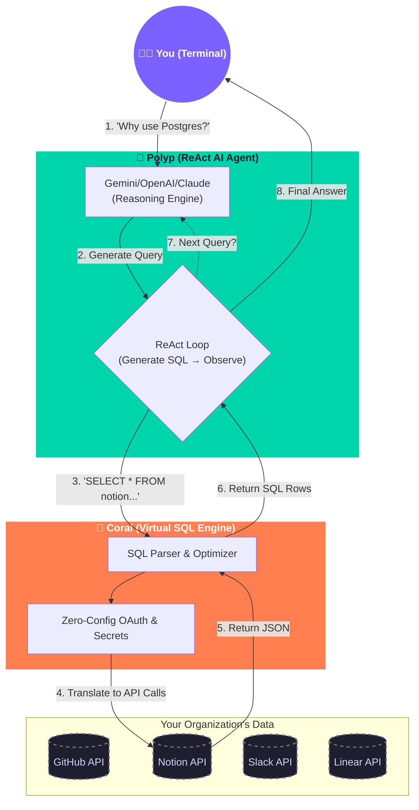

<div align="center">
  
  <h1>Polyp 🪸</h1>
  <p><b>Organizational Intelligence — Powered completely by Coral</b></p>
  
  [](https://badge.fury.io/js/polyp-ai)
  [](https://opensource.org/licenses/MIT)
</div>

<br />

**Polyp** is an elite, terminal-native AI agent designed to answer complex questions about your organization by seamlessly querying your knowledge bases, issue trackers, and codebases in real-time.

Instead of building fragile integrations with dozens of APIs, Polyp is completely powered by [Coral](https://getcoral.ai), utilizing its revolutionary approach to treat your entire SaaS ecosystem as a unified SQL database.

---

## ⚡️ The Power of Coral Under the Hood

Polyp is not just an LLM wrapper. It is a true **ReAct (Reason + Act) Agent** that dynamically interfaces with the **Coral CLI**.

When you ask Polyp a question:
1. **Schema Discovery**: Polyp automatically discovers your connected integrations via Coral's schema.
2. **Dynamic SQL Generation**: The AI translates your natural language question into precise SQL queries targeting Coral's virtual tables (`github.issues`, `notion.search`, `slack.messages`, etc.).
3. **Iterative Reasoning**: If the AI needs to find a Notion page ID before fetching its contents, it will intelligently run a search query, parse the output, and run a *second* query completely automatically.
4. **Zero Configuration Integration**: Because Coral handles all OAuth, token management, and pagination, Polyp requires absolutely no API keys for your data sources.

## 🚀 Getting Started

### 1. Install Coral
Polyp relies on Coral as its underlying data engine.
```bash
brew install withcoral/tap/coral
```

### 2. Install Polyp
```bash
npm install -g polyp-ai
```

### 3. Connect your Data Sources
Connect the platforms your organization uses. Coral supports everything out of the box!
```bash
polyp connect github
polyp connect notion
polyp connect linear
```

### 4. Set up the AI
Provide your preferred LLM API key (OpenAI, Anthropic, or Gemini) for the reasoning engine.
```bash
polyp config
```

---

## 💻 Usage

Polyp provides multiple ways to interact with your data.

### Interactive ReAct Chat
The core feature of Polyp. Jump into a persistent AI loop and ask anything.
```bash
polyp chat
```
> **Ask Polyp ›** *What were the main decisions made in the "Q3 Roadmap" Notion document?*
> 
> **Ask Polyp ›** *Who authored the last 3 commits in our main repository?*

### Deep Investigations
Need a comprehensive report on a topic across all your tools?
```bash
polyp investigate "OAuth timeout issues"
```

### Persistent Context
Don't want to type your GitHub organization name over and over again? Save it to Polyp's persistent memory, and the AI will automatically inject it into its queries.
```bash
polyp context set github_owner runningpoem30
```

### Raw SQL (Bypass AI)
You can directly query Coral through Polyp without using the AI.
```bash
polyp query "SELECT id, url FROM notion.search"
```

---

## 🏗️ Architecture & Tech Stack

Polyp is built for speed, beauty, and intelligence.

- **Engine:** Node.js / TypeScript
- **Data Layer:** [Coral](https://getcoral.ai) (Virtual SQL over APIs)
- **AI Reasoning:** ReAct Loop Architecture (OpenAI, Anthropic, Gemini)
- **UI / Aesthetics:** `boxen`, `chalk`, `ora`, `gradient-string`



---

<div align="center">
  <i>Built for the Coral AI Assemble Hackathon</i>
</div>
